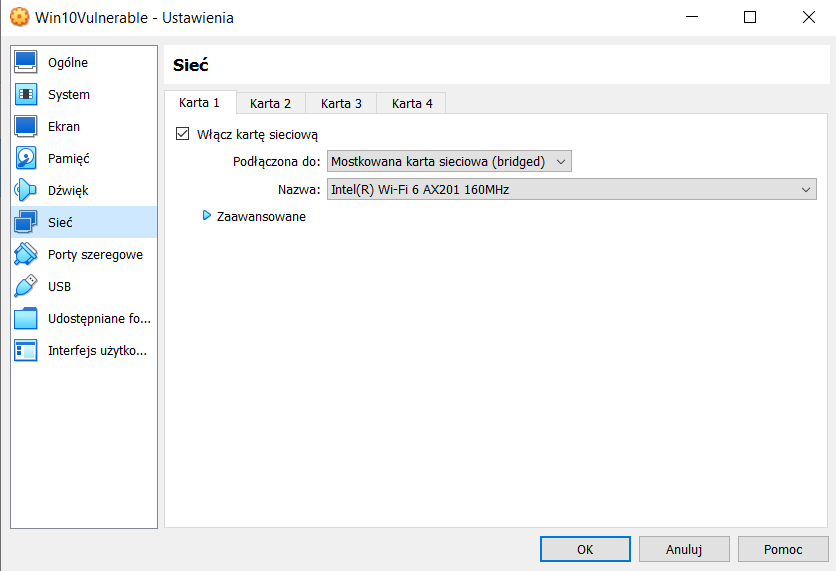
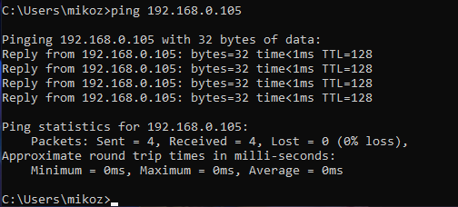
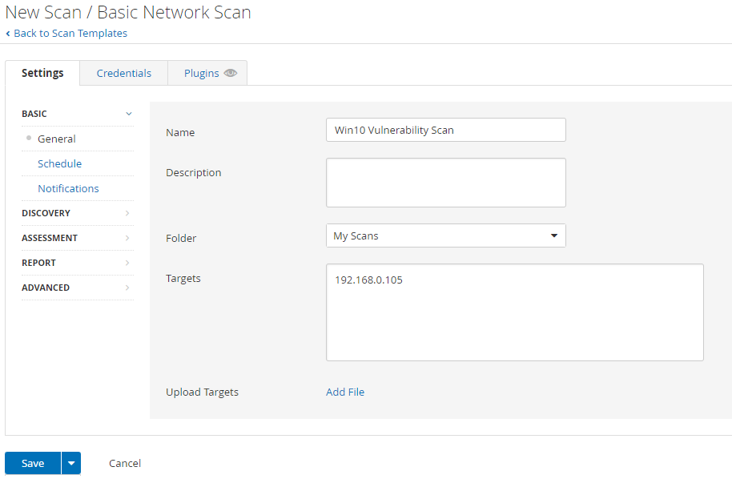
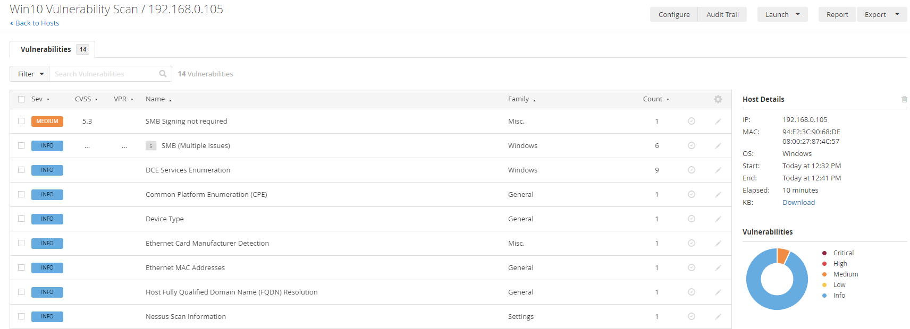
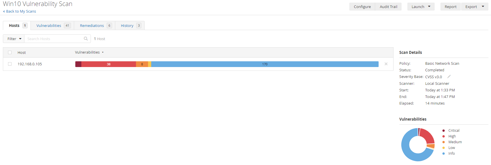
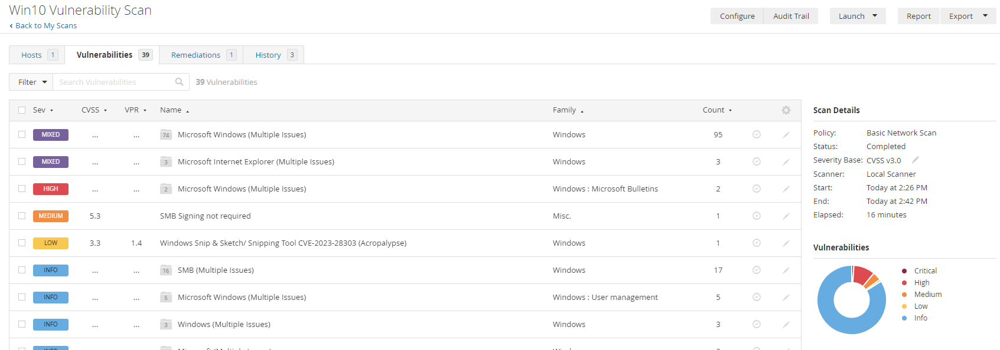
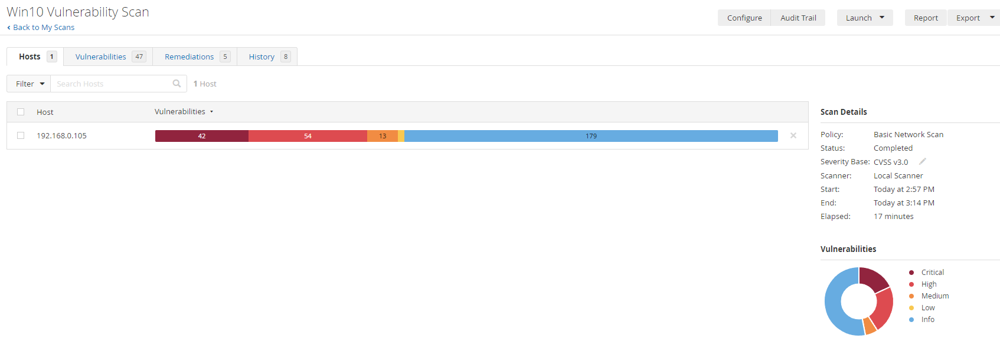
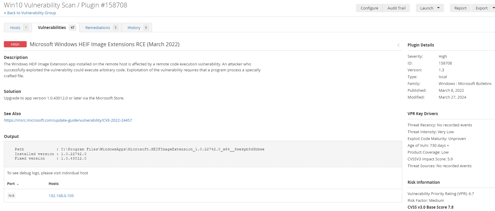
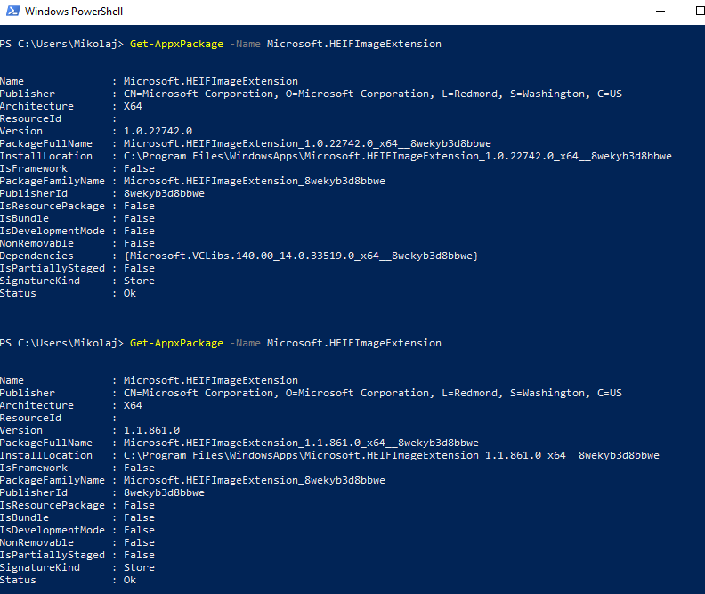
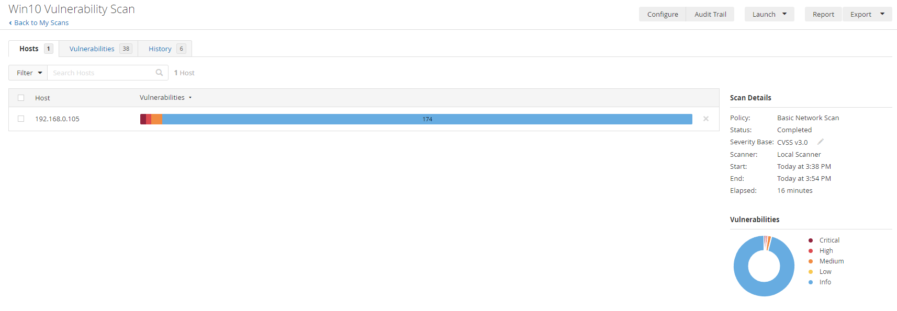

# Vulnerability Management HomeLab
## Using Nessus Essentials

## Table of Contents

1. [Project Description](#project-description)
2. [Configuration](#configuration)
3. [Implementation Steps](#implementation-steps)
4. [Skills Acquired](#skills-acquired)
5. [Additional Resources](#additional-resources)

## Project Description

This project aims to create a practical environment for vulnerability management using Nessus Essentials. By setting up a HomeLab with VirtualBox, I sought to gain hands-on experience in identifying and managing vulnerabilities within a controlled environment. The project was inspired and guided by materials provided by the Josh Madakor YouTube channel.

## Configuration

### Tools and Software Used

- VirtualBox for virtualization, Windows 10
- Nessus Essentials for vulnerability scanning

### Initial Setup

1. Created Windows 10 virtual machine using VirtualBox
2. Installed and configured Nessus Essentials for vulnerability scanning

## Implementation Steps

1. **Virtual Machine Setup:**
   - Created Windows 10 VM
   - Configured Network settings with Network Adapter in Bridge mode, which was necessary to establish communication between host OS and guest OS.
   
---
2. **Nessus Essentials Setup:**
   - Downloaded Nessus Essentials from the official website.
   - Installed Nessus Essentials
---
3. **Establishing Connection with VM:**
   - Ensured connectivity between the virtual machine and the host computer by pinging the VM.
    
    
---
4. **Nessus Essentials first scan:**
   - Configured scan settings

        

   - Ran first scan without Credentials
        

    First scan without Credentials is not providing many information because it doesn't have access to deeply scan the system, because of that there are only few vulnerabilities found and most of them are informational.
---
5. **Nessus Essentials Credential scan:**
   - Configured Windows 10 VM to accept Credentials scans
   - Configured Nessus Essentials Credentials scan
        
   - Ran Credentials Scan
        
        

    Second scan with Credentials provided much more information about vulnerabilities in the system. The system is relatively clean because it has been installed recently but there are found vulnerabilities to deal with. I will start by updating Windows on the VM and scanning again to see if there will be fewer problems because most of them are outdated software.
---
6. **Updating Windows VM and scanning:**
   - Updated Windows 10 VM
   - Ran third scan with Credentials
        

    After updating Windows there are much less vulnerabilities however not all of them were remediated just by simple update. Rest of the vulnerabilities are still outdated software applications but these one need manual update.
---
7. **Simulating vulnerabilities:**
   - Installed outdated software on the VM
        
   - Ran fourth scan to see if Nessus finds old software vulnerabilities
        
    
    After installing outdated software there are many vulnerabilities with high severity. Nessus Essentials even provide remediations to take to remove main vulnerabilites, these remediatons are high levels solutions, not all vulnerabilities can be removed by them.
        
---
8. **Remediating vulnerabilities:**
    I will uninstall outdated software to deal with new vulnerabilities caused by software that I installed before. I will also try to remediate some other vulnerabilities.
    One example is HEIF Image Extension:
        
    I used solutions provided by Nessus Essentials, first I checked the software version and then find out it was outdated so I manually updated it.
        
---
9. **Last scan:**
   - Ran Credentials Scan after remediating few vulnerabilities
        
   Number of high severity level vulnerabilities decreased significantly which means that my remediations were good. There are some vulnerabilities left, most of them are still caused by outdated software but some of them I cannot remediate because I made my VM a little bit vulnerable to allow it to accept scans.

## Skills Acquired

Through the implementation of this project, I acquired the following skills:
- Setting up virtual environments with VirtualBox.
- Installing and configuring Nessus Essentials for vulnerability scanning.
- Conducting vulnerability scans and interpreting the results.
- Understanding the importance of credentials in vulnerability assessment.
- Identifying and prioritizing vulnerabilities based on severity.
- Implementing remediation strategies to address identified vulnerabilities.

## Additional Information

- Josh Madakor YouTube Channel: [link](https://www.youtube.com/@JoshMadakor)
